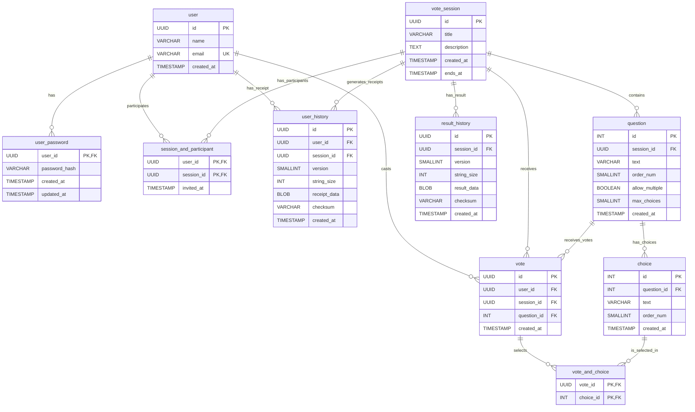

# db

## Schema 

## Notes

### Migration SQLite → PostgreSQL

#### Changements nécessaires :
- TEXT (UUID) → UUID natif
- TEXT (timestamp) → TIMESTAMPTZ
- INTEGER (boolean) → BOOLEAN
- INTEGER AUTOINCREMENT → SERIAL
- Ajouter DEFAULT gen_random_uuid() pour les UUID
- Ajouter DEFAULT NOW() pour les timestamps